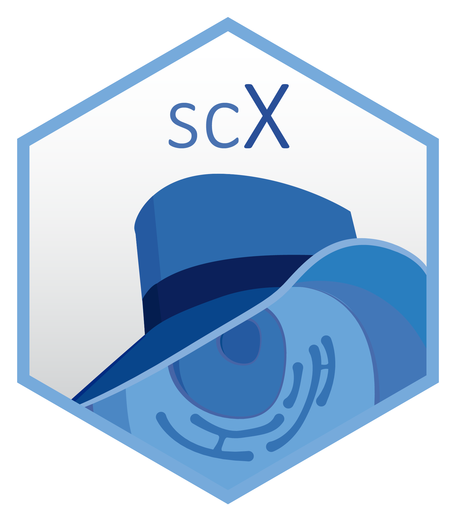
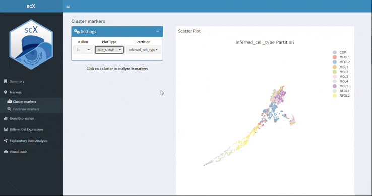

<h1 align="center">  scX package </h1>

 scX is an R package that enables interactive visualization and analysis of single-cell experiment data by creating a Shiny-based application. With scX all aspects of single-cell data can be explored using a large number of different types of plots, such as scatter plots, heatmaps, boxplots, dot and violins plots, etc. All the information associated with cells can be displayed in a customized way: both numerical variables such as logcounts or pseudotime values, and categorical variables such as cell types or sample. One of the main hallmarks of scX is the possibility to plot the main embeddings used for single cell - UMAP, tSNE and PCA - both in 2D and 3D in an interactive way. Thus, embeddings can be rotated, translated and zoomed. But scX is not only a visualization tool, it also allows you to perform different types of analysis on single cell data, such as finding the markers of a cell type or determining the differential genes between two different conditions.

---

<h2>Installation</h2>

scX requires certain packages to be installed. If you do not have these, you can execute the following code:

<pre class="downlit sourceCode r">
<code class="sourceCode R">BiocManager::<a href="https://rdrr.io/pkg/BiocManager/man/install.html" class="external-link">install</a>(c("SingleCellExperiment","scran","scater","ComplexHeatmap"))</code></pre>

scX can be installed from GitHub as follows:

<pre class="downlit sourceCode r">
<code class="sourceCode R">devtools::<a href="https://remotes.r-lib.org/reference/install_github.html" class="external-link">install_github</a>("chernolabs/scX")</code></pre>

You can also check the <a href="https://chernolabs.github.io/scX/articles/get_started.html" class="external-link">detailed explanation</a> of what the app can do using the package example data, or interact with our available <a href="http://scx.leloir.org.ar/" class="external-link">app example</a>.

