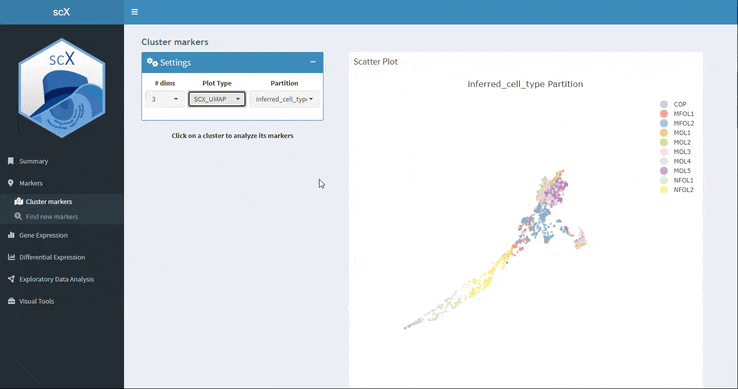
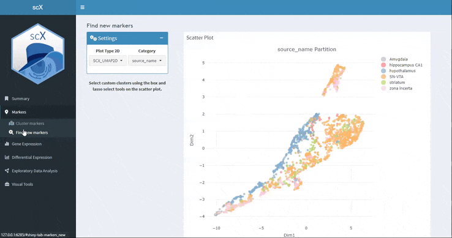

```{r, include = FALSE}
knitr::opts_chunk$set(
  echo = FALSE,
  fig.path = "man/figures/",
  collapse = TRUE,
  comment = "#>"
)
```

<p align="justify">  
This section allows to find and interact with the markers of each different clusterization. In the Markers section there are two types of analysis. On the one hand, in "Cluster markers" clicking on a cell displays a table with the marker genes of the cluster to which that cell belongs. On the other hand, in "Find new markers" you can select a group of cells in the embedding and scX will calculate their marker genes.
</p>

 
###  Cluster markers 

<p align="justify">  
This section allows you to find the marker genes for the partition defined in the single-cell object, typically cell types or cell states. Clicking on one of the cells in the embedding will display a table of marker genes for the partition to which that cell belongs. For each of the markers different metrics such as boxcor, robustness and FDR are displayed. This table can be downloaded in various formats, such as .csv, .xlsx .pdf, or you can copy it to the clipboard. 

By clicking on a marker in the table you can see its expression profile across the entire dataset in the embedding. In addition violin and spikeplots are displayed at the bottom.
</p>

```{r}


```


### Find new markers 

<p align="justify">  
Here you can select with the box or lasso tool a set of cells in the embedding and scX will calculate the marker genes. You can download not only the marker table but also the selected cell list.

As in the previous section, if you click on one of the markers you can see its expression along the dataset with violin and spikeplots.
</p>

```{r}


```


