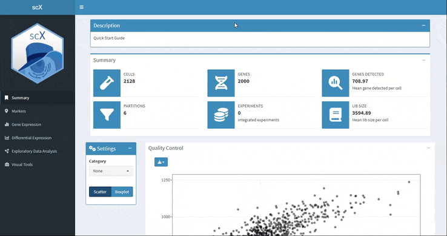

```{r, include = FALSE}
knitr::opts_chunk$set(
  echo = FALSE,
  fig.path = "man/figures/",
  collapse = TRUE,
  comment = "#>"
)
```


<p align="justify">  
scX displays a summary of the main descriptive information of the dataset: number of cells and genes, mean number of genes detected per cell, partions, experiments and average library size.

In the Summary section, you can explore through graphical visualization the coventional quality control metrics: this is the relationship between the number of features and the count numbers. In this plot you can distinguish the cells coming from the different partitions of the dataset.
</p>

```{r}


```

