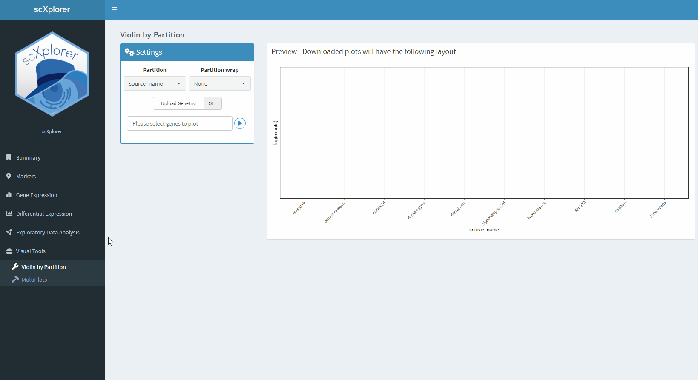

```{r, include = FALSE}
knitr::opts_chunk$set(
  echo = FALSE,
  fig.path = "man/figures/",
  collapse = TRUE,
  comment = "#>"
)
```

In the "Visual Tools" section, different plots can be obtained to explore in more depth different aspects of the single-cell experiment data, such as how the expression of a given set of genes varies at different levels of a feature or to recognise a set of cells of interest within an embedding.


## Violin by Partition 

By selecting or uploading a set of genes of interest, a set of Violin plots can be obtained and download in .pdf format, allowing to facet the plots by differents categorical co-variables.


```{r}


```


##  Multiplots

Multiplots allows you to explore how different variables change across cells in an embedding of your choice, such as the expression of a given set of genes, the partitions of a categorical variable or the value of a continuous variable.
 

```{r}
knitr::include_graphics("figures/multiplots.gif")

```


